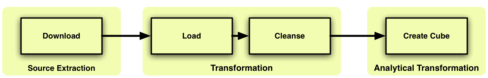

Building The Data Warehouse
===========================

Plan
----

Goals of Data Warehouse
"""""""""""""""""""""""

Before we delve into the details of dimensional modeling and implementation, it is helpful
to focus on fundamental goals of the data warehouse. How can we focus on these
these fundamental goals if we are missing the most important thing, the **data**.

Based on our experience, the data is the universum that drive the bedrock requirements for
the data warehouse. The data comes first, than the technology and the bussiness model.

Finding the Data
################

After couple of weeks of searching we have identified several open to public data sources:

* `UK Gov <https://www.gov.uk>`_
* `Open Spending <https://openspending.org>`_
* `U.S. Government’s open data <https://www.data.gov>`_
* `Usa Spending Gov <https://www.usaspending.gov/Pages/Default.aspx>`_

We have decided to looking for government data. We exemined couple of datasets and
we picked `Usa Spending Gov <https://www.usaspending.gov/Pages/Default.aspx>`_.
Their data looked the most promicing and they provide great
`document <https://www.usaspending.gov/about/PublishingImages/Pages/TheData/USAspending.gov%20Data%20Dictionary.pdf>`_
information about the data fields, description and their formats.

**Identifying the data source**

All the prime recipient transaction data on `USAspending.gov <https://www.usaspending.gov>`
is reported by the federal agencies making contract, grant, loan, and other financial assistance awards.
After identifying the data source and examination of the data sets we have decided to use this data
for our business model and data warehouse model.

**Mission of data warehouse**

We have concluded the following goals for our data warehouse:

**The main mission of the data warehouse is to publish the federal organisations data.**
The key success of our data warehouse is whether the data warehouse effectively contributes to the general public.
The success of a data warehouse begins end ends with its users.

The data warehouse is going to be open to public. **It must make the information easily accessible.**
The content of the data warehouse must be understandable. The data must be intuitive and obvious to the business user,
not merely the developer.

**The data warehouse must present the federal organisations information consistently.**
Data must be carefully assembled from a variety of sources around the organization, cleansed, quality assured,
and released only when it is fit for user consumption.

**The data warehouse must be adaptive and resilient to change.**
We want to track changes of federal awards made by federal agencies.
The data warehouse must be designed to handle this change.

Data warehouse Environment
--------------------------
It is helpful to understand the pieces of the data warehouse before we begin to combine them.
Each component serves specific function.

.. figure:: images/dw_pieces.jpg
   :scale: 100 %

   Data warehouse components

Operational Source systems
""""""""""""""""""""""""""

The  operational system directly captures the execution of a business process,
in our case capture the transactions of federal agencies. The operational source system is outside the data warehouse,
we have no control over the content and format of the data in these systems. In our case the operational system is
`usaspending.gov <https://www.usaspending.gov>`_ where we just download directly from they site a .csv flat file.

Data Staging Area
"""""""""""""""""

The data staging is a physical storage area and a set of extract-transformation-load (ETL) jobs.
The data staging are is everything between the source systems and the data presentation area.
This is the stage where we perform various process on the data to fit into data warehouse environment.

Data presentation
"""""""""""""""""

The data presentation area is where the structured data is organized, stored,
and made available for querying and for analytical applications. The presentation area is based
on online analytic processing (OLAP) technology, this means the data is stored in cubes.

Data access tools
"""""""""""""""""

The final piece of the data warehouse is the data access tool. Obviously the first access tool
can be a simple query tool for querying.  We provide to our end users the general public set of
tools for development of reporting, analysis and browsing of data trough our web application using the concept of Cubes.

Data Staging Area
-----------------

The ETL system is the foundation of the data warehouse. We have design an ETL system that extracts data from the source
system, enforces data quality and consistency, conforms data so that separate flat files can be used together,
and delivers data into presentation layer where we build the application so that end users can make decisions. We haven’t
used any ETL tools every process/job is all hand coded.

   ETL process flow

Extract - E
"""""""""""

The `usaspending.gov <https://www.usaspending.gov>`_  website doesn’t provide any API, only single page with the download able link.
The raw data coming from the source system is stored locally on the disk. We have downloaded 4 different .csv flat files.

.. figure:: images/e.png
   :scale: 100 %

   Figure [5]

Dimensional Modeling
--------------------

Business Process
""""""""""""""""

The first step in the design is to decide what business process to model by understanding of
the business requirements with an understanding of the available data. In our open government case study,
the general public wants to better understand how the government spends money, what kind of transactions are
made in their neighbourhood. Thus our process is a transactional model. This transactional data will allow us
to analyse what kind of awards are made by federal agencies in which states on what days and to whom.
Brief description of business model that we’ll use in our case study to make dimension and fact tables
more understandable. Imagine a federal agency for example Department of Agriculture making a award for a
recipient 1901 Combine Group, LLC for a combine harvester in Texas on 2015. To summarise it WHICH federal
agency is awarding WHOM for WHAT and WHERE is the place of the performance of the transaction made.

Declare the Grain
"""""""""""""""""

Once the business process has been identified. we faced a serious decision about the granularity of the data warehouse.
What level of data detail should be made available in the dimensional model?
After identifying the data, we had couple of options to choose. We wanted tackling the data at it’s lowest level,
most atomic grain made the most sense. The more detailed and atomic the fact measurement, the more things we know for
sure about federal awards. In this regard, atomic data was the perfect match for the dimensional approach.
Atomic data provides the maximum analytic flexibility because it can be constrained and rolled up in every way possible.
In our case study, the most granular data is an individual transaction made by federal agencies. Because of this level of
grain we ensured maximum dimensionality and flexibility. Providing access to the transactions information gave us very
detailed look at federal award changes. For example, the end users want to see how many transaction were made for one
individual award or how the award has changed over period of time, if the agency made a modification to an award,
reduced a portion of the original award amount or made additional funding.None of them could have been answered if we wouldn't
elected the lowest granularity just the summarised data.

Choose the Dimensions
"""""""""""""""""""""

After we have declared the grain of the fact table, the recipient, agency, date, geography, award, dimensions fall out immediately.
We assume that the calendar date is the date when the award was signed.

In our case study we have decided on the following dimensions:

.. figure:: images/dw_schema_tbd.png
   :scale: 100 %

   Preliminary star schema.

Dimension tables are not in third normal form. A dimensional model serves a different purpose from ER model.
It wasn’t necessary to isolate repeating values in an environment that doesn't support transaction processing.
If we would have made additional normalisation within dimensions, we would end up with the schema that is referred as a snowflake.
We have encouraged to resist the urge to snowflake given our to primary design, ease of use and performance.

* Snowflaked tables makes for much more complex presentation.
* Database design will struggle with the complexity of the snowflaked schema.
* Numerous tables and joins usually translate into slower query performance.
* Minor disk space savings.
* Snowflaking slows down the user’s ability to browse within the dimension.

Dimension tables also contain key columns that uniquely identify something in an operational system.
These key columns are referred to as natural keys. The separation of surrogate keys and natural keys
allows the data warehouse to track changes, even if the originating operational system does not.

Identify Facts
""""""""""""""

At the core of a star schema is the fact table. In addition to presenting the facts, the fact table includes surrogate
keys that refer to each of the associated dimension tables. Each row in the fact table stores facts at a specific
level of detail of our grain that we have declared. Facts tend to be numeric in value. We have made the decision
that the award amount is going to be our fact measurement which will appear in our fact table. We have decided
to stored physically in the data warehouse only one fact the award mount, which is additive across all dimensions.

Suroggate Keys
""""""""""""""

In the star schema, each dimension table is given a surrogate key. This column is a unique identifier,
created exclusively for the data warehouse. The surrogate key is the primary key of the dimension table.
In our case, surrogate keys are randomly generated integers that are assigned sequentially when populate
dimension tables during the ETL process. For example, the first recipient record is assigned a recipient
surrogate key with the value of 1, the next recipient record is assigned recipient key with value 2, and
so forth. The surrogate keys serve to join the dimension tables to the fact table. One of the most important
reasons why are we using surrogate keys and doesn’t just rely on natural keys from the source system is to
support handling changes to dimension table attributes.

Dimensional Table Attributes
----------------------------
