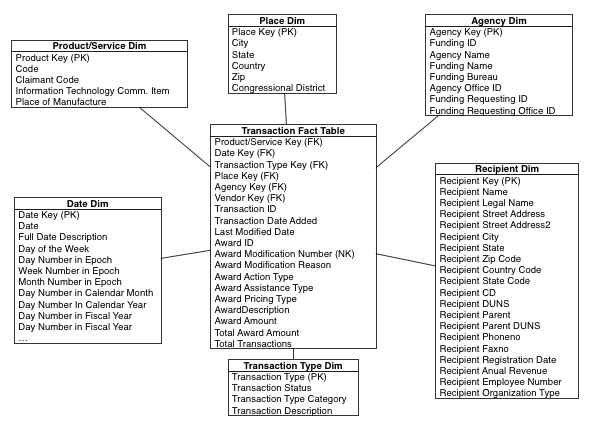

Introduction
==============

Data
----

**What is Data?**
"""""""""""""""""

Data is all around us. But what exactly is? Data is a value assigned to a thing.
What can we say about the balls in the picture? They are
tennis balls, right? So one of the first data points we have is that they are used for tennis.
Tennis is a category sport, so this helps us to to put the balls in a taxonomy.
But there is more to them. We have the colour: “green”, the condition “new”.
They all have sizes. All kind of objects have lot of data attached to them.
Even people do: they have a name a date of birth, weight, height etc.
All these things are data [1]_.

.. figure:: images/tennis.jpg
   :scale: 50 %

   Tennis Balls

.. [1] Authors: School of Data
       Organization: School of Data
       Date: Sep 02, 2013
       Available from: `Data Fundamentals <http://schoolofdata.org/handbook/courses/what-is-data/>`_

**Qualitative** data is everything that refers to the quality of something.
A description of experiences, a description of colours, and interview are all qualitative data.
Data that can be observed but not measured.

**Quantitative** data is data that refers to a number. Data that can be measured. E.g. the number of tennis balls, the size, a score on a test etc.

**Categorical** data puts the item you are describing into a category. For example the condition “new”, “used”, “broken” etc.

**Discrete data** is a numerical data that has gaps in it: e.g. the count of golf balls. There can only be whole numbers of tennis balls, there is no such thins as 0.5 golf balls.

**Continues** data is a numerical data with a continues range: e.g. size of a tennis balls can be any size (86.02mm), or the size of your foot (as opposed to your shoe size, which is discrete). In continues data, all values are possible with no gaps between .

**From Data to information knowledge**
""""""""""""""""""""""""""""""""""""""
Data, when collected and structured suddenly becomes a lot more useful.

+--------------+----------+
|Category      |Contract  |
+==============+==========+
|Date          | 2015     |
+--------------+----------+
|Amount        | $1232.21 |
+--------------+----------+
|Recipient     |Apple Inc.|
+--------------+----------+

**Data**: Content that is directly observable or verifiable; a fact - it’s -5C outside.

**Information:** Content that represents analyzed data - “it’s -5C outside I’ll take a warm coat".

**Knowledge:** “I remember the last time when was this cold I got a cold. I’ll therefore take a scarf and gloves.
But first I’ll check with Brian. He usually dress too light for this kind of weather.”
Knowledge is created when the information is learned, applied and understood.

**Context:** One thing incredibly important for data is context: A number or quality doesn’t mean a thing if you don’t give context.
So explain what you are showing – explain how it is read, explain where the data comes from and explain what you did with it.
If you give the proper context the conclusion should come right out of the data.

**Finding Data**
""""""""""""""""

+----------------+-----------------------------+
|**Data Source** | **Description**             |
+================+=============================+
|csv             | Comma Separated values (CSV)|
+----------------+-----------------------------+
|xls             |MS Excel Spreadsheet         |
+----------------+-----------------------------+
|gdoc            |Relational database table    |
+----------------+-----------------------------+
|mongodb         |MongoDB database             |
+----------------+-----------------------------+

There are three basic ways of getting hold of data:

  1. **Finding data** - involves searching and finding data that has been already released

  2. **Getting hold of more data** - asking for “new” data from official sources e.g. trough
     Freedom of Information requests. Sometimes data is public on a website but there is not
     a download link to get hold of it in bulk! This data can be liberated with what
     datawranglers call scraping.

  3. **Collecting data yourself** - gathering data and entering it into a database or a
     spreadsheet.

Identify data source
""""""""""""""""""""

In recent years *governments* have begun to release some of their data to the public - open data.
Many governments host special (open) government data platforms for the data they create.
For example the UK government started `UK Data <https://www.ukdataservice.ac.uk>`_, or USA `data.gov <http://www.data.gov>`_.
Other sources of data are large *organisations*.
The World Bank and the World Health Organization for example regularly release reports and data sets.
Scientific projects and institutions release data to the scientific community and the general public.
Open data is produced by `NASA <https://www.nasa.gov>`_ for example, and many specific disciplines have their own data repositories, some of which are open.

Problem with sources
""""""""""""""""""""

There are plenty of places where you can get hand on open datasets which are open to public, however these
sources are often unstructered, very messy, ambiguous, mis-use of class attributes, non-consistent, missing values,
etc. The unstructured data growing quickiest than the other, and their exploitation could help in business decision.

.. code-block:: html
   :name: example of unstructed data

   5896	34513500 34513500-1	\N	\N Transport equipment
   3031	48825000 48825000-7	\N	\N	Software package
   5821	34144900 34144900-7	1.9721673495	\N	Transport equipment

Open Data
---------

Do you know exactly how much of your tax money is spent on street lights or on public transportation? And what is in the air that you breathe along the way? Where in your region will you find the best job opportunities and the highest number of fruit trees per
capita? When can you influence decisions about topics you deeply care about, and whom should you talk to?

New technologies now make it possible to build the services to answer these questions automatically. Much of the data you would need to answer these questions is generated by public bodies. However, often the data required is not yet available in a form which is easy to use - take for example our country Slovakia it still lack of data transparency and creating data sets which can be easy to used.

The notion of open data and specifically open government data - information, public or otherwise, which anyone is free to access and re-use for any purpose - has been around for some years.

Why open Data?
""""""""""""""

Open data, especially open government data, is a tremendous resource that is as yet largely untapped. Many individuals and organisations collect a broad range of different types of data in order to perform their tasks. Government is particularly significant in this respect, both because of the quantity and centrality of the data it collects, but also because most of that government data is public data by law, and therefore could be made open and made available for others to use. Why is that of interest?

There are also many different groups of people and organisations who can benefit from the availability of open data, including government itself. At the same time it is impossible to predict precisely how and where value will be created in the future.

It is already possible to point to a large number of areas where open government data is creating value. Some of these areas include:

* Transparency and democratic control
* Participation
* Self-empowerment
* Improved or new private products and services
* Innovation
* Improved efficiency of government services
* Improved effectiveness of government services
* Impact measurement of policies
* New knowledge from combined data sources and patterns in large data volumes

Open government data can also help you to make better decisions in your own life, or enable you to be more active in society. A woman in Denmark built `findtoilet.dk <http://findtoilet.dk>`_, which showed all the Danish public toilets, so that people she knew with bladder problems can now trust themselves to go out more again.
Services like ‘mapumental’ in the UK and ‘mapnificent’ in Germany allow you to find places to live, taking into account the duration of your commute to work, housing prices, and how beautiful an area is. All these examples use open government data.

Open data is also of value for government itself. For example, it can increase government efficiency. The Dutch Ministry of Education has published all of their education-related data online for re-use. Since then, the number of questions they receive has dropped, reducing work-load and costs, and the remaining questions are now also easier for civil servants to answer, because it is clear where the relevant data can be found. Open data is also making government more effective, which ultimately also reduces costs.

While there are numerous instances of the ways in which open data is already creating both social and economic value, we don’t yet know what new things will become possible. New combinations of data can create new knowledge and insights, which can lead to whole new fields of application. We have seen this in the past, for example when Dr. Snow discovered the relationship between drinking water pollution and cholera in London in the 19th century, by combining data about cholera deaths with the location of water wells.

This untapped potential can be unleashed if we turn public government data into open data. This will only happen, however, if it is really open, i.e. if there are no restrictions (legal, financial or technological) to its re-use by others. Every restriction will exclude people from re-using the public data, and make it harder to find valuable ways of doing that. For the potential to be realized, public data needs to be open data.

What is Open Data?
""""""""""""""""""

Open data is data that can be freely used, re-used and redistributed by anyone - subject only, at most, to the requirement to attribute and sharealike [3]_.

.. [3] Open Definition `see <http://opendefinition.org>`_

The full Open Definition gives precise details as to what this means. To summarize the most important:

* **Availability and Access:** the data must be available as a whole and at no more than a reasonable reproduction cost, preferably by downloading over the internet. The data must also be available in a convenient and modifiable form.

* **Re-use and Redistribution:** the data must be provided under terms that permit re-use and redistribution including the intermixing with other datasets.

* **Universal Participation:** everyone must be able to use, re-use and redistribute - there should be no discrimination against fields of endeavour or against persons or groups. For example, ‘non-commercial’ restrictions that would prevent ‘commercial’ use, or restrictions of use for certain purposes (e.g. only in education), are not allowed.

If you’re wondering why it is so important to be clear about what open means and why this definition is used, there’s a simple answer: **interoperability**.

Interoperability denotes the ability of diverse systems and organizations to work together (inter-operate). In this case, it is the ability to interoperate - or intermix - different datasets.

Interoperability is important because it allows for different components to work together. This ability to componentize and to ‘plug together’ components is essential to building large, complex systems. Without interoperability this becomes near impossible — as evidenced in the most famous myth of the Tower of Babel where the (in)ability to communicate (to interoperate) resulted in the complete breakdown of the tower-building effort.
We face a similar situation with regard to data. The core of a “commons” of data (or code) is that one piece of “open” material contained therein can be freely intermixed with other “open” material. This interoperability is absolutely key to realizing the main practical benefits of “openness”: the dramatically enhanced ability to combine different datasets together and thereby to develop more and better products and services.

Providing a clear definition of openness ensures that when you get two open datasets from two different sources, you will be able to combine them together, and it ensures that
we avoid our own ‘tower of babel’: lots of datasets but little or no ability to combine them together into the larger systems where the real value lies [4]_.

.. [4] Open Knowledge `Open Data Handbook <http://opendatahandbook.org/guide/en/what-is-open-data/>`_

Data Warehouse Fundamentals
---------------------------

What is Data Warehouse
""""""""""""""""""""""

A data warehouse (DW or DWH) is a system used for reporting and data analysis.
Data Warehouse's are central repositories of integrated data from one or more disparate sources.
They store current and historical data and are used for creating analytical reports for knowledge workers throughout the enterprise. Examples of reports could range from annual and quarterly comparisons and trends to detailed daily sales analyses.

*A data warehouse is a system that extracts, cleans, conforms, and delivers source data into a dimensional data store and then supports and implements querying and analysis for the purpose of decision making* [5]_.

.. [5] The Data Warehouse ETL Toolkit, Ralph Kimball, Joe Casetra, Copyright 2004 by Wiley Publishing, Inc. All rights reserved., eISBN: 0-764-57923-1

Operational Systems
"""""""""""""""""""

An operational system directly supports the execution of a business process.
By capturing details about significant events or transactions.
A sales system, for example captures information about orders, shipments, and returns.

Operational systems must enable several types of database interaction, including inserts, updates,
and deletes - these interactions are almost always atomic.
For example, an order entry system must provide for the management of lists of products, customers,
and salespeople; the entering of orders; the printing of order summaries, invoices, and packing
lists; and the tracking order status. The operational system is likely to update as things change
(if a customer moves, his/her old address is no longer useful so it is simply overwritten),
and archive data ones it’s operational usefulness has ended.
Operational systems are implemented in a relational database, the design may called entity-relationship model,
or ER model. The schema of operational systems are highly accepted to be in third normal form.

Analytic Systems
""""""""""""""""

An analytical system supports the *evaluation* of a business process.
How are orders trending this month versus last?
Where does this put us in comparison to our sales goals for the quarter?
Is a particular marketing promotion having an impact on sales? Who are our best customers?

Interaction with an analytic system takes place through queries that retrieve data
about business processes. Historic data will remain important to the analytic system long after
its operational use has passed.

**OPERATIONAL SYSTEM VS. ANALYTICAL SYSTEM**

+---------------------------+------------------------------------------------------------------------------+-----------------------------------+
|                           |                              Operational System                              |          Analytic System          |
+---------------------------+------------------------------------------------------------------------------+-----------------------------------+
|          Purpose          | Execution of a business process                                              | Measurement of a business process |
+---------------------------+------------------------------------------------------------------------------+-----------------------------------+
| Primary Interaction Style | Insert, Update, Delete, Query                                                | Query                             |
+---------------------------+------------------------------------------------------------------------------+-----------------------------------+
| Scope of Interaction      | Individual transaction                                                       | Aggregated transactions           |
+---------------------------+------------------------------------------------------------------------------+-----------------------------------+
| Querry Patterns           | Predictable and stable                                                       | Unpredictable and changing        |
+---------------------------+------------------------------------------------------------------------------+-----------------------------------+
| Temporal Focus            | Current                                                                      | Current and historic              |
+---------------------------+------------------------------------------------------------------------------+-----------------------------------+
| Design Optimaziation      | Update concurrency                                                           | High-performance query            |
+---------------------------+------------------------------------------------------------------------------+-----------------------------------+
| Design Principle          | Entity-relationship (ER) design in third normal form (3NF)                   | Dimensional design                |
|                           |                                                                              | (Starschema or Cube)              |
+---------------------------+------------------------------------------------------------------------------+-----------------------------------+
| Also Known As             | Transaction System,Online Transaction Processing System (OLTP),Source System | Data Warehouse System,Data Mart   |
+---------------------------+------------------------------------------------------------------------------+-----------------------------------+

Analytic Databases and Dimensional Design
"""""""""""""""""""""""""""""""""""""""""

The dimensional model of a business process is made up of two components: *measurements* and their *context*.
Known as facts and dimensions, these components are organized into a database design that
facilities a wide variety of analytic usage. Implemented in a relational database, the dimensional
model is called a star schema. Implemented in a multidimensional database, it is known as a cube.
The core of every dimensional model is a set of business metrics that captures how a process is evaluated,
and a description of the context of every measurement [6]_.

.. [6] Excerpt From: Adamson, Christopher. “Star Schema The Complete Reference.” Copyright 2010 by The McGraw-Hill Companies, Inc. All rights reserved. ISBN: 978-0-07-174433-1

**Purpose**

Analytic systems and operational systems serve fundamentally different purposes.
An operational system supports the execution of a business process, while and
analytic system supports the evaluation of the process [7]_.

.. [7] Excerpt From: Adamson, Christopher. “Star Schema The Complete Reference.” Copyright 2010 by The McGraw-Hill Companies, Inc. All rights reserved. ISBN: 978-0-07-174433-1

**Measurement and Context**

Dimensional design supports analysis of a business process by modeling how it is
measured. Consider the following business questions:

* What are gross margins by product category for June?
* What is the average transaction by states level?
* What is the return rate by visitors?

These questions do not focus on individual activities or transactions.
To answer them, it is necessary to look at a group of transactions - in a bigger picture.
Each of these questions reveals something about how its respective business process is measured.

Every dimensional solution describes a process by capturing what is measured and the context in which the measurements are evaluated [8]_.

.. [8] Excerpt From: Adamson, Christopher. “Star Schema The Complete Reference.” Copyright 2010 by The McGraw-Hill Companies, Inc. All rights reserved. ISBN: 978-0-07-174433-1

**Facts and Dimensions**

In a dimensional design, measurements are called facts, and context descriptors are called dimensions.
Facts tend to be numeric in value. Elements that are aggregated, summarized, or subtotaled are facts.

+------------+---------------+
| **FACTS**  |**DIMENSIONS** |
+------------+---------------+
|   Amount   | Product       |
+------------+---------------+
| Min Amount | Agency        |
+------------+---------------+
| Max Amount | Award         |
+------------+---------------+
|            | Geography     |
+------------+---------------+

The Star Schema
"""""""""""""""

A dimensional design for a relational database is called a star schema.
Related dimensions are grouped as columns in dimension tables, and the facts
are stored as columns in a fact table.

Dimension tables are not in third normal form. A dimensional model serves a different purpose from ER model.
It is not necessary to isolate repeating values in an environment that doesn't support transaction processing.
When additional normalization is performed within dimensions, in such cases, the schema is referred as a snowflake.

   Star Schema example

**Dimension Tables**

In a star schema, a dimension table contains columns representing dimensions.
These columns provide context for facts.

**Fact Table**

At the core of a star schema is the fact table.
Each row in the fact table stores facts at a specific level of detail.
This level of detail is known as the fact table’s grain

